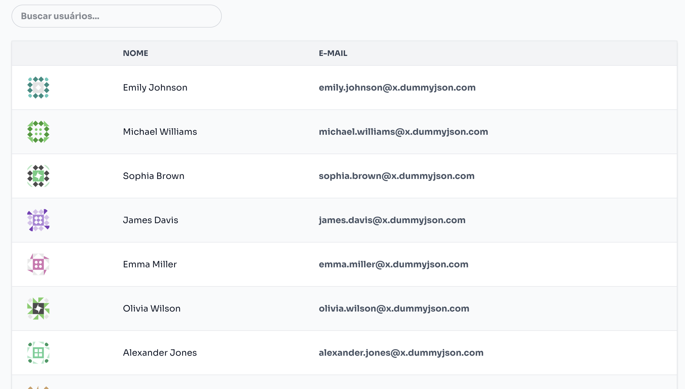
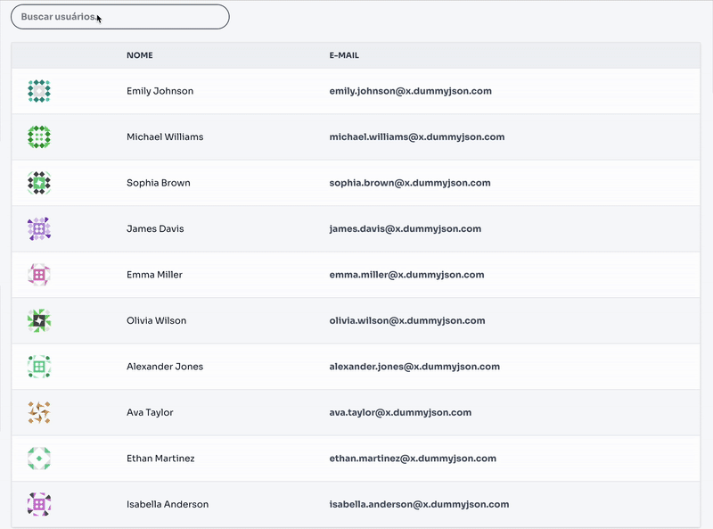
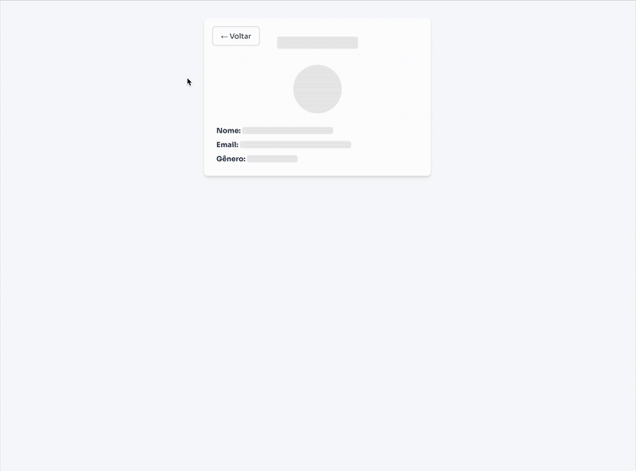

# 🧑‍💻 Projeto de Listagem de Usuários

URL do deploy: https://pac360.vercel.app/

Este projeto é uma aplicação frontend construída com **React + Vite** que consome uma API REST para listar usuários com **paginação**, **loading skeleton**.

---

## 🚀 Tecnologias

- [React](https://react.dev/)
- [Vite](https://vitejs.dev/)
- [TypeScript](https://www.typescriptlang.org/)
- [Axios](https://axios-http.com/)
- [React Router](https://reactrouter.com/)
- [Tailwind CSS](https://tailwindcss.com/)
- [React Loading Skeleton](https://github.com/dvtng/react-loading-skeleton)
---

## 📦 Instalação

```bash
git clone https://github.com/FelipeZeferino/pac360.git
cd pac360
npm install
```

Crie um arquivo `.env` na raiz do projeto e defina as variáveis de ambiente necessárias, por exemplo:

```env
VITE_API_URL=https://sua-api.com
```

A api pública usada no projeto tem a seguinte url: "https://dummyjson.com"

```bash
npm run dev
```






Decisões técnicas:

Arquitetura baseada em funcionalidades e tipos de arquivos

os arquivos foram separados por tipo: components, contexts, interfaces..
e por funcionalidade dentro do sistema, componentes genéricos ficam na pasta components, mas componentes específicos dentro da respectiva pasta da funcionalidade/domínio.
├── components/
│   └── Button.tsx  ← genérico
├── users/
│   ├── UserTable.tsx ← específico da feature

A userService é responsável por centralizar toda a lógica de acesso à API, transformação dos dados e regras de negócio relacionadas a usuários.

Tempo estimado:

Configuração inicial do projeto - 1h
Desenvolvimento - 4h
Testes - 1h
Deploy e documentação - 1h

Total - 7h


